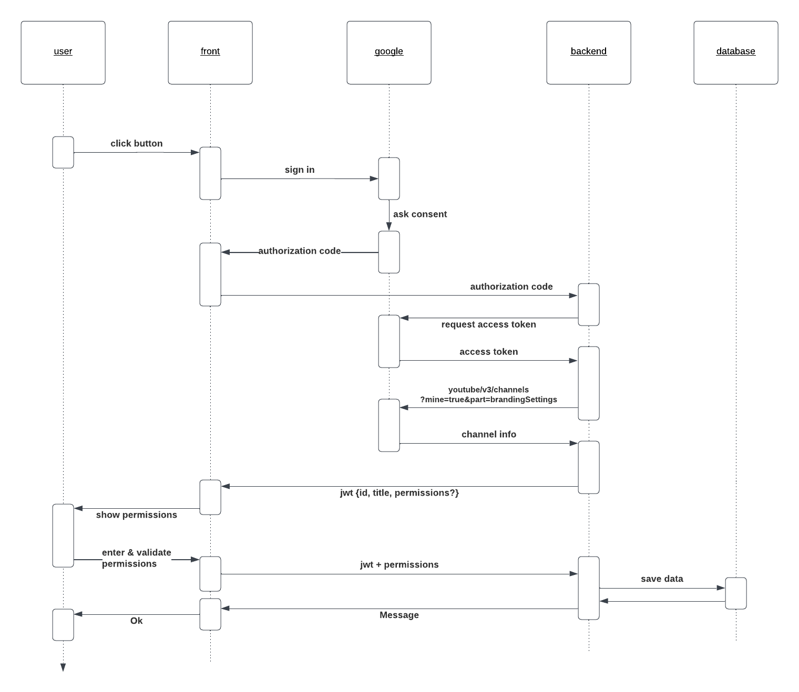

# yt-react-db backend

Welcome to the repository containing the code of the backend for [yt-react-db.com](https://yt-react-db.com).
This is an HTTP server providing a REST API written in rust using [actix-web](https://actix.rs/). Data is stored in a PostgreSQL database.
Why rust? [Because](https://youtu.be/St8iEpkcDJc?si=Z2RbFyMBoZvq8CFd&t=5)

- Problems or feature requests: [issue tracker](https://github.com/yt-react-db/issue-tracker/issues)
- [Discussions](https://github.com/yt-react-db/issue-tracker/discussions)
- or use [twitter](https://twitter.com/ComputerBread)


## Endpoints

* `GET /health_check` to know if app is alive
* `POST /get_the_juice` returns the youtube channel ID & title of a youtuber inside a
jwt, after he logged in & consent for the youtube.readonly scope (check [authorization code flow](https://developers.google.com/identity/oauth2/web/guides/how-user-authz-works#when_using_the_auth_code_flow))
* `GET /permissions/full_list`: to get full list of permissions
* `GET /permissions/<channel-ID>`: to get permissions of a specific channel
* `POST /set_permissions`: to save permissions given by a youtuber

## Configuration

The application is configured using environment variables & the `config/config.yaml`
file. Environment variables should be put inside a `.env` file:

```ini
DATABASE_URL="postgres://<username>:<password>@<host>:<port>/<database-name>"

# for app
#database
DATABASE.URL="postgres://<username>:<password>@<host>:<port>/<database-name>"
DATABASE.USERNAME="<username>"
DATABASE.PASSWORD="<password>"

# google
GOOGLE.CLIENT_SECRET="<google-client-secret>"
```

## log

log level default is DEBUG.
To change, use the `RUST_LOG` environment variable:

`RUST_LOG=info`

log levels: error, warn, info, debug, trace

## DB stuff

postgresql 15
docker: (cf script/start_db.sh & script/docker-compose.yml)
init db:

* `sqlx database create` to create a database, relies on the `DATABASE_URL` env
variable `postgres://${DB_USER}:${DB_PASSWORD}@${DB_PORT}/${DB_NAME}`
* to create a migration: `sqlx migrate add <us_id>_<name_of_migration>`
    * it creates a directory `migrations`
    * and adds a file `{timestamp}_<name_of_migration>.sql`
* to run a migration: `sqlx migrate run`
* sqlx creates a table `sqlx_migrations` to keep track of already run.


## How it works

A user click on the button which opens a google popup.
User log in & give consent for us to access the `youtube.readonly` [scope](https://developers.google.com/youtube/v3/guides/auth/installed-apps#identify-access-scopes).
Once it's done, we get an [authorization code](https://developers.google.com/identity/oauth2/web/guides/how-user-authz-works#when_using_the_auth_code_flow)
and send it to the backend using the `/get_the_juice` endpoint.
In the backend, we exchange the authorization code for an access token. Using the
access token, we get the channel ID and title of the youtuber. We return this 
information in a short-lived jwt. In the frontend, the user gives her permissions,
that we store in the backend (`set_permissions`).



## useful links


* <https://docs.rs/sqlx/latest/>
    * <https://docs.rs/sqlx/latest/sqlx/trait.Type.html>
    * <https://docs.rs/sqlx/latest/sqlx/trait.FromRow.html#rename_all>
* <https://docs.rs/sqlx-postgres/latest/sqlx_postgres/>

